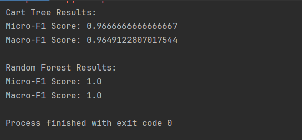
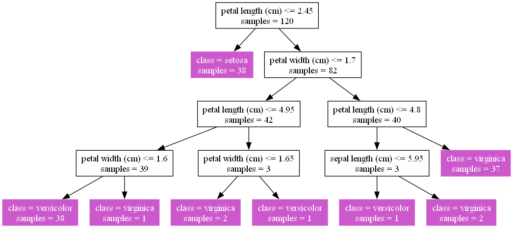

# Decision Tree实验报告

[toc]

## Iris数据集的分析与处理

Iris数据集中的每个样本包含了花萼长度、花萼宽度、花瓣长度、花瓣宽度四个特征，标签为鸢尾花的种类，scikit-learn中提供了该数据集，可以直接使用，该库还提供了`train_test_split`方法以便于使用数据集生成测试集与训练集，具体代码如下：

```python
# 获取Iris数据集
iris = datasets.load_iris()
labels_name = iris.feature_names
target_name = iris.target_names
# 获取训练集与测试集
x_train, x_test, y_train, y_test = train_test_split(iris.data, iris.target, test_size=0.2)
```

## CART Tree的原理与实现

 CART算法通过递归地将数据集划分为子集，构建一棵二叉树。在每个节点上，CART算法选择一个特征和一个切分点，将数据集划分为两个子集。划分的目标是最小化子集中的不纯度，从而使得子集中的样本尽可能属于同一类别或具有相似的输出值，其中CART算法使用“Gini指数”来度量样本集合纯度，相关定义：

K个分类：$$Gini(p)=\sum_{k=1}^K(1-p_k)p_k=1-\sum_{k=1}^Kp_k^2$$ 

数据集𝑫：$$Gini(D)=1-\sum_{k=1}^K(\frac{|C_k|}{|D|})^2$$

属性𝑨对数据集的划分：$$Gini(D,A)=\frac{|D_1|}{|D|}Gini(D_1)+\frac{|D_2|}{|D|}Gini(D_2)$$

递归地重复这个过程，直到满足停止条件，如达到最大树深度或子集中的样本数小于某个阈值。

**对于连续值的处理：**m个样本的连续特征A有m个，从小到大排列$a_1,a_2,......,a_m$，则CART取相邻两样本值的平均数做划分点，一共取m-1个，其中第i个划分点$T_i$ 表示为：$T_i = (a_i + a_{i+1})/2$。分别计算以这m-1个点作为二元分类点时的基尼系数，并选择基尼系数最小的点为该连续特征的二元离散分类点。

以下为具体实现：

CART Tree以递归方式生成部分

```python
class TreeNode:
    def __init__(self, attributes, labels):
        self.is_leaf = False
        self.attributes = attributes
        # 判断是否停止迭代
        if len(set(labels)) == 1:
            self.label = labels[0]
            self.is_leaf = True
        else:
            properties = []
            for i in range(attributes.shape[1]):
                gini_num, split_num = min_gini(labels, attributes[:, i])
                properties.append((i, gini_num, split_num))
            # 获取二元离散分类点
            index = np.argmin(list(map(lambda x: x[1], properties)))
            self.prop = properties[index][0]
            self.gini = properties[index][1]
            self.split_num = properties[index][2]
            left_attr = []
            left_labels = []
            right_attr = []
            right_labels = []
            for i in range(len(attributes)):
                if attributes[i][self.prop] <= self.split_num:
                    left_attr.append(attributes[i])
                    left_labels.append(labels[i])
                else:
                    right_attr.append(attributes[i])
                    right_labels.append(labels[i])
            # 递归方式生成决策树
            self.left_node = TreeNode(np.array(left_attr), left_labels)
            self.right_node = TreeNode(np.array(right_attr), right_labels)
```

对于某一属性找到最小基尼系数计算函数

```python
def min_gini(labels, attributes):
    centrals = []
    new_list = []
    label_set = np.unique(labels)
    for i in range(len(labels)):
        new_list.append((labels[i], attributes[i]))
    sort_list = np.copy(attributes)
    sort_list.sort()
    for i in range(len(attributes) - 1):
        centrals.append((sort_list[i] + sort_list[i + 1]) / 2)
    split_num = 0
    min_gini_num = None
    for num in centrals:
        left = []
        right = []
        for i in range(len(new_list)):
            if new_list[i][1] <= num:
                left.append(new_list[i][0])
            else:
                right.append(new_list[i][0])
        left_gini = 1
        right_gini = 1
        for label in label_set:
            if len(left) != 0:
                left_gini -= (left.count(label) / len(left)) ** 2
            if len(right) != 0:
                right_gini -= (right.count(label) / len(right)) ** 2
        gini_now = left_gini * len(left) / len(attributes) + right_gini * len(right) / len(attributes)
        if min_gini_num is None or min_gini_num > gini_now:
            min_gini_num = gini_now
            split_num = num
    return min_gini_num, split_num
```

## 使用随机森林优化决策树

使用bagging算法，生成k个决策树，以投票方式产生最终结果，具体代码为：

```python
# 抽取训练集样本以生成树
for _ in range(k):
    x_samples, _, y_samples, _ = train_test_split(x_train, y_train, test_size=0.3)
    forests.append(TreeNode(np.array(x_samples), y_samples))
random_forest_result = []
# 计算Random Forest的结果
for tree in forests:
    random_forest_result.append(list(map((lambda x: tree.calculate_result(x)), x_test)))
random_forest_result = np.array(random_forest_result).T
voting_result = []
for line in random_forest_result:
    voting_result.append(np.argmax(np.bincount(line)))
```

## 验证集评估结果

使用scikit-learn所给出的Micro-F1和Macro-F1分数计算方法，得到以下测试结果：



## 使用Graphviz对决策树的可视化结果

