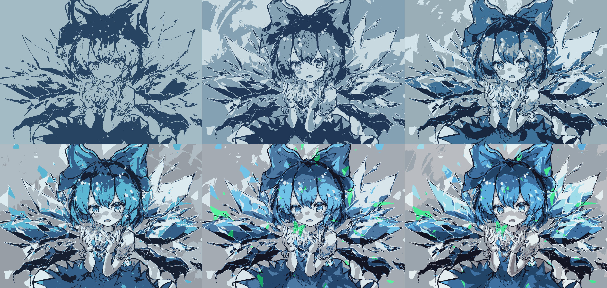

# K-means实验报告

[toc]

## K-means算法原理

K-means算法是一种经典的无监督分类算法，利用相似性度量方法来衡量数据集中所有数据之间的关系，将关系比较密切的数据划分到一个集合中。以下为K-means算法的基本步骤：

1. 在样本中随机选取k个样本点充当各个簇的中心点$$μ_1$$,$$μ_2$$,…,$$μ_k$$
2. 对每个样本点，使用某种距离度量方法计算样本点到k个中心点的距离，将样本点分到距离它最近的聚类中心所属的聚类
3. 重新计算聚类中心，聚类中心为属于这一个聚类的所有样本的均值
4. 如果没有发生样本所属聚类改变的情况，则退出，否则返回2继续

由K-means算法得到的聚类结果严重依赖与初始簇中心的选择，如果初始簇中心选择不好，就会陷入局部最优解，因此我们可以选择K-means++算法来改善选取初始中心点步骤：

1. 在数据集中随机选取一个样本点作为第一个簇中心$$C_1$$
2. 计算剩余样本点与所有簇中心的最短距离，令为$$D(x^{(i)})=min[dist(x^{(i)},C_1),dist(x^{(i)},C_2),dist(x^{(i)},C_3),...,dist(x^{(i)},C_n)]$$某样本点被选为下一个簇中心的概率为$$\frac{D(x^{(i)})^2}{\sum{D(x^{(j)})^2}}$$
3. 重复2直到选出k个簇中心
4. 完成与K-means同样的迭代

## 核心实现代码

引入相关库

```python
import cv2
import numpy as np
import matplotlib.pyplot as plt
```

选择聚类大小，初始化相关数据

```python
image = cv2.imread('9.jpg', 1)
cluster_image = image.copy()
pixel_list = []
index_ = 0
n = int(input('cluster number:'))
for i in range(len(cluster_image)):
	for j in range(len(cluster_image[0])):
		pixel_list.append(Pixel(i, j, index_, cluster_image[i][j]))
		index_ += 1
```

使用K-means++的算法寻找初始的k个中心点

```python
init_pixel = np.random.randint(0, len(pixel_list))
centrals = [pixel_list[init_pixel]]
for i in range(1, n):
	cent_len_list = []
	cent_list = []
	for pixel in pixel_list:
		if pixel.index not in map(lambda x: x.index, centrals):
			pixel_min_len, index = pixel.min_length(centrals)
			cent_len_list.append(pixel_min_len)
			cent_list.append(index)
	p = cent_len_list / np.sum(cent_len_list)
	num = np.random.choice(cent_list, p=p)
	next_cent = pixel_list[num]
	centrals.append(next_cent)
```

获取最终的聚类，设置`i`以防止不收敛导致的死循环

```python
# 获得第一次聚类的结果
centrals, clusters = kmeans(centrals, pixel_list)
new_centrals, new_clusters = kmeans(centrals, pixel_list)
i = 0
# 聚类迭代直到满足条件或者上限
while continue_iteration(clusters, new_clusters) and i < 10000000:
    centrals = new_centrals
    clusters = new_clusters
    new_centrals, new_clusters = kmeans(centrals, pixel_list)
    i += 1
```

重新绘制图像

```python
for i in range(len(new_centrals)):
    for p in new_clusters[i]:
        cluster_image[p.loc_x][p.loc_y] = new_centrals[i].color
plt.imsave('9-cluster-' + str(n) + '.png', cluster_image)
```

## 结果图片

原图片：


当k=2, 3, 4, 6, 8, 10的结果：



## 聚类可视化图片(k = 3)

