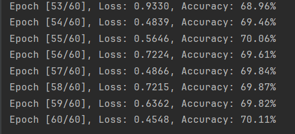
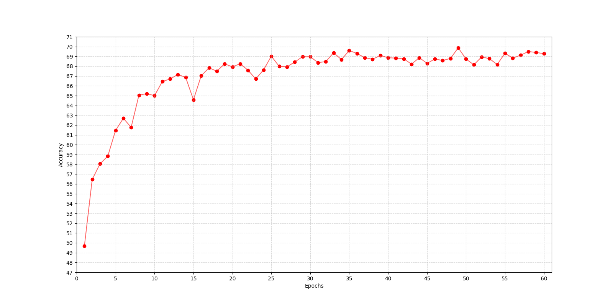
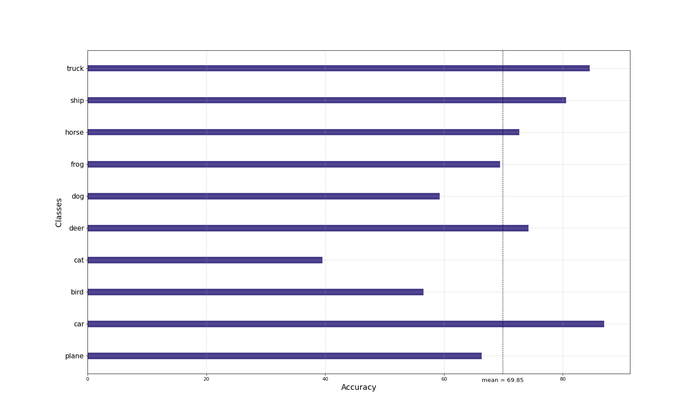

# LeNet-5

[toc]

## CIFAR-10数据集

CIFAR-10是一个更接近普适物体的是3通道的彩色RGB 图像数据集，一共包含10 个类别。每个图片的尺寸为32 × 32 ，每个类别有6000个图像，数据集中一共有50000 张训练图片和10000 张测试图片。可通过torchvision.datasets导入该数据集的训练集与测试集。

## LeNet-5神经网络

LeNet-5的基本结构包括7层网络结构（不含输入层），其中包括2个卷积层、2个降采样层（池化层）、2个全连接层和输出层。

1. **输入层（Input layer）**：输入层接收大小为$32×32$的图像
2. **卷积层C1（Convolutional layer C1）**：卷积层C1包括6个卷积核，每个卷积核的大小为$5×5$ ，步长为1，填充为0。因此，每个卷积核会产生一个大小为$28×28$的特征图（输出通道数为6）。
3. **采样层S2（Subsampling layer S2）**：采样层S2采用最大池化（max-pooling）操作，每个窗口的大小为 2×2 ，步长为2。因此，每个池化操作会从4个相邻的特征图中选择最大值，产生一个大小为 14×14 的特征图（输出通道数为6）。
4. **卷积层C3（Convolutional layer C3）**：卷积层C3包括16个卷积核，每个卷积核的大小为$5×5$ ，步长为1，填充为0。因此，每个卷积核会产生一个大小为 10×10 的特征图（输出通道数为16）。
5. **采样层S4（Subsampling layer S4）**：采样层S4采用最大池化操作，每个窗口的大小为$ 2×2 $，步长为2。因此，每个池化操作会从4个相邻的特征图中选择最大值，产生一个大小为 5×5 的特征图（输出通道数为16）。
6. **全连接层C5（Fully connected layer C5）**：全连接层C5将每个大小为$ 5×5 $的特征图拉成一个长度为400的向量，并通过一个带有120个神经元的全连接层进行连接。120是由LeNet-5的设计者根据实验得到的最佳值。
7. **全连接层F6（Fully connected layer F6）**：全连接层F6将120个神经元连接到84个神经元。
8. **输出层（Output layer）**：输出层由10个神经元组成，每个神经元对应0-9中的一个数字，并输出最终的分类结果。在训练过程中，使用交叉熵损失函数计算输出层的误差，并通过反向传播算法更新卷积核和全连接层的权重参数。

## 代码实现

根据论文定义LeNet-5神经网络

```python
class LeNet5(nn.Module):
    def __init__(self):
        super(LeNet5, self).__init__()
        # 卷积层C1
        self.conv1 = nn.Conv2d(in_channels=3, out_channels=6, kernel_size=5)
        # 采样层S2
        self.pool1 = nn.MaxPool2d(kernel_size=2, stride=2)
        # 卷积层C3
        self.conv2 = nn.Conv2d(in_channels=6, out_channels=16, kernel_size=5)
        # 采样层S4
        self.pool2 = nn.MaxPool2d(kernel_size=2, stride=2)
        # 全连接层C5
        self.fc1 = nn.Linear(in_features=16 * 5 * 5, out_features=120)
        # 全连接层F6
        self.fc2 = nn.Linear(in_features=120, out_features=84)
        # 输出层
        self.fc3 = nn.Linear(in_features=84, out_features=10)

    def forward(self, x):
        x = self.pool1(torch.relu(self.conv1(x)))
        x = self.pool2(torch.relu(self.conv2(x)))
        x = x.view(-1, 16 * 5 * 5)
        x = torch.relu(self.fc1(x))
        x = torch.relu(self.fc2(x))
        x = self.fc3(x)
        return x
```

定义相关超参数与transform函数以提高训练效果

```python
# 定义超参数
device = torch.device('cuda' if torch.cuda.is_available() else 'cpu')
model = LeNet5().to(device)
criterion = nn.CrossEntropyLoss()
optimizer = torch.optim.Adam(model.parameters(), lr=0.00065, weight_decay=0.0008)
epochs = 60
# 定义transform函数
transform = transforms.Compose([transforms.Resize((32, 32)),
                                transforms.RandomHorizontalFlip(p=0.45),  # 随机水平翻转
                                transforms.ToTensor(),  # 标准化
                                transforms.Normalize((0.4914, 0.4822, 0.4465),
                                                     (0.2023, 0.1994, 0.2010))])  # 根据CIFAR10数据集做出调整
```

读取CIFAR-10数据集

```python
train_dataset = datasets.CIFAR10(root='./data/', train=True, transform=transform, download=True)
train_loader = torch.utils.data.DataLoader(train_dataset, batch_size=32, shuffle=True, num_workers=4)
test_dataset = datasets.CIFAR10(root='./data/', train=False, transform=transform, download=True)
test_loader = torch.utils.data.DataLoader(test_dataset, batch_size=32, shuffle=False, num_workers=2)
```

训练神经网络后通过测试集进行测试并重复`epochs`次

```python
for epoch in range(epochs):
    model.train()
    for images, labels in train_loader:
        # 将数据放入模型
        images = images.to(device)
        labels = labels.to(device)
        optimizer.zero_grad()
        outputs = model(images)
        loss = criterion(outputs, labels)
        loss.backward()
        optimizer.step()
    # 在测试集上测试模型
    model.eval()
    correct = 0
    with torch.no_grad():
        for images, labels in test_loader:
            # 将数据放入模型
            images = images.to(device)
            labels = labels.to(device)
            outputs = model(images)
            _, predicted = torch.max(outputs, 1)
            correct += (predicted == labels).sum().item()
    # 输出该epoch的精度
    accuracy = 100 * correct / len(test_dataset)
    print('Epoch [{}/{}], Loss: {:.4f}, Accuracy: {:.2f}%'.format(epoch + 1, epochs, loss.item(), accuracy))
```

保存该模型

```python
torch.save(model.state_dict(), 'model.pth')
```

## 实验结果

在训练60个epoch后能达到70%左右的精度



而对于数据集中不同的分类，其精度也有较大差异，对于猫、狗、鸟的识别精度较差，而对于汽车、卡车、船的精度较高。


## 实验数据分析

通过实验可以发现LeNet-5神经网络对CIFAR-10无法达到较高的识别精度，而通过多次调整参数可以发现精度可以快速到达65%左右，之后便很难继续提高。



CIFAR-10测试数据集中不同分类的精确度可视化


