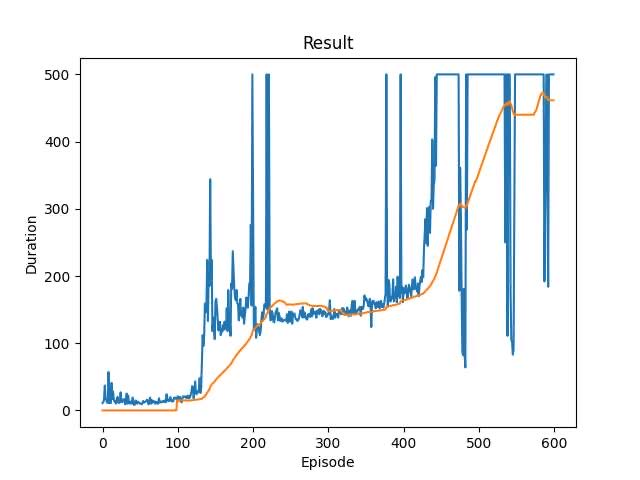

# 强化学习

## Cart Pole强化学习场景

倒立摆（Cart Pole）小游戏，游戏里面有一个小车，上有竖着一根杆子，每次重置后的初始状态会有所不同。小车需要左右移动来保持杆子竖直，为了保证游戏继续进行需要满足以下两个条件：

1. 杆子倾斜的角度θ不能大于15°
2. 小车移动的位置x需保持在一定范围（中间到两边各2.4个单位长度）

而通过openai gym库我们可以得到这样一个倒立摆小游戏的场景，并考虑通过强化学习中的DQN算法，以实现对倒立摆游戏的学习。

其中**state, action, value, reward**分别为：

### State:
| State                 | min  | max  |
| --------------------- | ---- | ---- |
| Cart Position         | -2.4 | 2.4  |
| Cart Velocity         | -Inf | Inf  |
| Pole Angle            | -15° | 15°  |
| Pole Angular Velocity | -Inf | Inf  |

### Action
| Action | 描述           |
| ------ | -------------- |
| 0      | 将倒立摆向左推 |
| 1      | 将倒立摆向右推 |

### Value

由于使用了DQN算法，$Q(s_t,a_t)$可通过神经网络获得结果，因此$V(s_{t+1})=max_aQ(s_{t+1},a)$

### Reward

在游戏源码中reward被定义为：如果不倒下或超过游戏时间将奖励设为1，倒下则为0。而为了提高训练的效率，当偏转角度过大或离边界越近时也会扣除相应的分数，以保证倒立摆的稳定性，具体实现为：

```python
observation, reward, terminated, truncated, _ = env.step(action.item())
pos, vel, theta, theta_vel = observation
if abs(pos) > 2.1:
    reward -= 0.01 * abs(pos)
if abs(theta) / env.theta_threshold_radians > 0.9:
    reward -= 0.15 * abs(theta)
```

## CartPole算法伪代码

1. 初始化经验池$\mathcal{D}$，容量为$N$

2. 随机初始化策略神经网络$Q_\phi$的参数$\phi$

3. 初始化目标神经网络$Q_\hat{\phi}$的参数$\hat{\phi}=\phi$

4. repeat:

   1. 初始状态s = env.reset()

   2. repeat:

      1. 通过贪心策略，选择当前s下value最大的行动a
      
      2. 执行动作a，得到即时奖励$r$和新的状态$s'$
      
      3. 将$s,a,r,s'$放入$\mathcal{D}$中
      
      4. 从$\mathcal{D}$中采样$ss,aa,rr,ss'$
      
      5. 若$ss'$已经达到了终止状态，$y=rr$；否则$y=rr+\gamma max_{a'}Q_{\hat{\phi}}(ss',a')$（其中$\gamma$为折扣率）
      
      6. $\delta=Q_{\phi}(ss, aa)-y$
      
      7. 以Huber loss为损失函数训练 $Q_\phi$ 网络，其定义如下
      
         $ \mathcal{L}=\frac{1}{|B|} \sum_{\left(ss, aa, ss^{\prime}, rr\right) \in B} \mathcal{L}(\delta) $ 其中$\mathcal{L}(\delta)=\left\{\begin{array}{ll}\frac{1}{2} \delta^{2} & \text { for }|\delta| \leq 1 \\ |\delta|-\frac{1}{2} & \text { otherwise }\end{array}\right.$
      
      8. $s = s'$
      
      8. $\hat{\phi}=\phi*TAU + \hat{\phi}*(1-TAU)$，其中TAU为目标神经网络更新速率
      
   3. 当$s$为终止状态时跳出循环
   
5. 达到预设的episode后跳出循环，结束学习

6. 得到最终的策略神经网络$Q_\phi$

## 代码实现

### 设置超参数

```python
BATCH_SIZE = 128
GAMMA = 0.99
EPS_START = 0.9
EPS_END = 0.05
EPS_DECAY = 1000
TAU = 0.005
LR = 1e-4
```

### 定义神经网络结构

```python
class DQN(nn.Module):
    def __init__(self, n_observations, n_actions):
        super(DQN, self).__init__()
        self.layer1 = nn.Linear(n_observations, 128)
        self.layer2 = nn.Linear(128, 128)
        self.layer3 = nn.Linear(128, n_actions)

    def forward(self, x):
        x = F.relu(self.layer1(x))
        x = F.relu(self.layer2(x))
        return self.layer3(x)
```

### 定义经验池结构与相关操作

```python
Transition = namedtuple('Transition',
                        ('state', 'action', 'next_state', 'reward'))


class ReplayMemory(object):
    def __init__(self, capacity):
        self.memory = deque([], maxlen=capacity)

    def push(self, *args):
        self.memory.append(Transition(*args))

    def sample(self, batch_size):
        return random.sample(self.memory, batch_size)

    def __len__(self):
        return len(self.memory)
```

### action选择

```python
def select_action(now_state):
    global steps_done
    sample = random.random()
    eps_threshold = EPS_END + (EPS_START - EPS_END) * math.exp(-1. * steps_done / EPS_DECAY)
    steps_done += 1
    if sample > eps_threshold:
        with torch.no_grad():
            # 选择value值最高的action
            return policy_net(now_state).max(1)[1].view(1, 1)
    else:
        return torch.tensor([[env.action_space.sample()]], device=device, dtype=torch.long)
```

### 模型优化

```python
def optimize_model():
    if len(memory) < BATCH_SIZE:
        return
    transitions = memory.sample(BATCH_SIZE)
    batch = Transition(*zip(*transitions))
    non_final_mask = torch.tensor(tuple(map(lambda s: s is not None, batch.next_state)), device=device,
                                  dtype=torch.bool)
    non_final_next_states = torch.cat([s for s in batch.next_state if s is not None])
    state_batch = torch.cat(batch.state)
    action_batch = torch.cat(batch.action)
    reward_batch = torch.cat(batch.reward)
    state_action_values = policy_net(state_batch).gather(1, action_batch)
    next_state_values = torch.zeros(BATCH_SIZE, device=device)
    with torch.no_grad():
        next_state_values[non_final_mask] = target_net(non_final_next_states).max(1)[0]
    # 计算预期Q值
    expected_state_action_values = (next_state_values * GAMMA) + reward_batch
    # 计算 Huber loss
    criterion = nn.SmoothL1Loss()
    loss = criterion(state_action_values, expected_state_action_values.unsqueeze(1))
    # 优化模型
    optimizer.zero_grad()
    loss.backward()
    torch.nn.utils.clip_grad_value_(policy_net.parameters(), 100)
    optimizer.step()
```

### CartPole训练

```python
# 选择gym库中的CartPole-v1，并更改最大倾斜角度
# env = gym.make('CartPole-v1', render_mode='human')
env = gym.make('CartPole-v1')
env.theta_threshold_radians = 15 * 2 * math.pi / 360
env.x_threshold = 2.4
# 获取action space的大小
actions = env.action_space.n
# 获取state observations的大小
state, _ = env.reset()
observations = len(state)
# 创建policy net与target net确保用来预测的r+maxQ‘与当前的Q独立以保证稳定性
policy_net = DQN(observations, actions).to(device)
target_net = DQN(observations, actions).to(device)
target_net.load_state_dict(policy_net.state_dict())
optimizer = optim.AdamW(policy_net.parameters(), lr=LR, amsgrad=True)
memory = ReplayMemory(MEMORY_CAPACITY)
for i_episode in range(600):
    state, _ = env.reset()
    state = torch.tensor(state, dtype=torch.float32, device=device).unsqueeze(0)
    for t in count():
        env.render()
        action = select_action(state)
        observation, reward, terminated, truncated, _ = env.step(action.item())
        pos, vel, theta, theta_vel = observation
        if abs(pos) > 2.1:
            reward -= 0.01 * abs(pos)
        if abs(theta) / env.theta_threshold_radians > 0.9:
            reward -= 0.15 * abs(theta)
        reward = torch.tensor([reward], device=device)
        done = terminated or truncated
        if terminated:
            next_state = None
        else:
            next_state = torch.tensor(observation, dtype=torch.float32, device=device).unsqueeze(0)
        # 将当前的transition放入经验池中
        memory.push(state, action, next_state, reward)
        state = next_state
        optimize_model()
        # 更新target network的权重
        # θ′ ← τ θ + (1 −τ )θ′
        target_net_state_dict = target_net.state_dict()
        policy_net_state_dict = policy_net.state_dict()
        for key in policy_net_state_dict:
            target_net_state_dict[key] = policy_net_state_dict[key] * TAU + target_net_state_dict[key] * (1 - TAU)
        target_net.load_state_dict(target_net_state_dict)
        if done:
            episode_durations.append(t + 1)
            break
    print(str(i_episode) + 'Complete')
env.close()
```


## 运行结果


