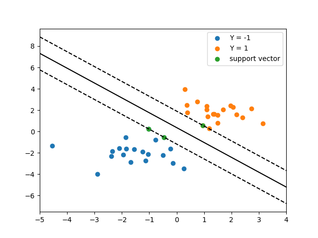

# SVM

## 生成SVM数据

```python
np.random.seed(0)
X = np.r_[np.random.randn(20, 2) - [2, 2], 
np.random.randn(20, 2) + [2, 2]]
Y = [-1] * 20 + [1] * 20
```

## SVM的实现

SVM是一个分离超平面，在二维向量的分类中，这种平面表现为多个直线将二维平面分为多个区域，在高维向量中，表现为超平面。在线性支持向量机中，一个样例会计算其到分界超平面的垂直距离，而SVM则是将所有训练样本的其离最近的超平面的距离最小化，而scikit-learn中为我们提供了`svm.SVC()`这一方法便于实现SVM，以下为核心代码：

```pyhton
model = svm.SVC(kernel="linear")
model.fit(X, Y)
```

输出支持向量：

```python
print("support vectors: ")
print(model.support_vectors_)
```

绘制超平面的示意图：

```python
# 绘制样本
plt.scatter(list(X[:20, 0]), list(X[:20, 1]), label='Y = -1')
plt.scatter(list(X[20:, 0]), list(X[20:, 1]), label='Y = 1')
plt.scatter(list(support_vectors[:, 0]), list(support_vectors[:, 1]), label="support vector")
# 绘制超平面
weight = model.coef_[0]
# 计算具体斜截式公式
bias = model.intercept_[0]
k = -weight[0] / weight[1]
b = -bias / weight[1]
xx = np.linspace(-5, 4, 10)
y_support_vector = k * xx + b
plt.plot(xx, y_support_vector, color='black')
# 绘制支持向量对应直线
b_0 = support_vectors[0][1] - k * support_vectors[0][0]
b_1 = support_vectors[model.n_support_[0]][1] - k * support_vectors[model.n_support_[0]][0]
y_0 = k * xx + b_0
y_1 = k * xx + b_1
plt.plot(xx, y_0, color='black', linestyle='--')
plt.plot(xx, y_1, color='black', linestyle='--')
plt.xlim(-5, 4)
plt.legend()
plt.savefig('svm.png')
plt.show()
```

## 支持向量
[-1.02126202  0.2408932 ]
[-0.46722079 -0.53064123]
[ 0.95144703  0.57998206]

## 超平面示意图

